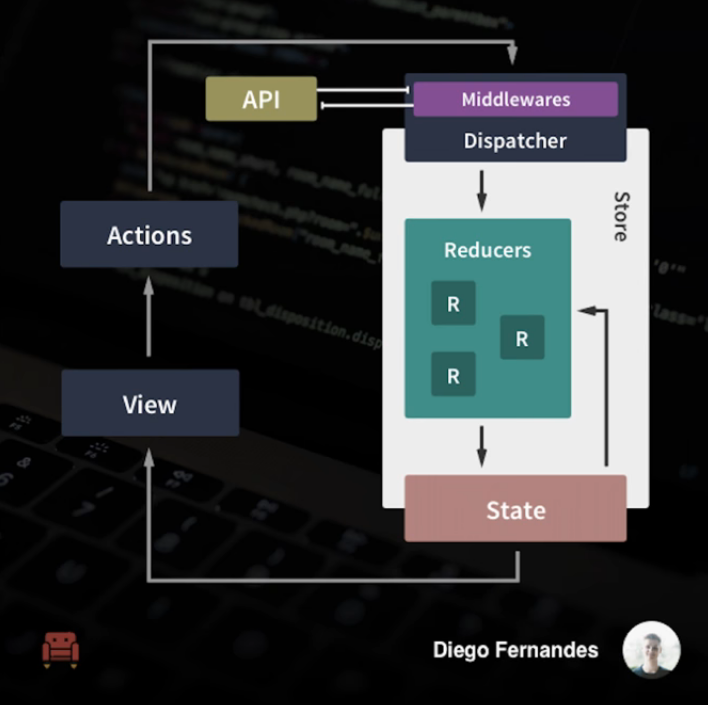

# CodeQuinta #1 - Arquitetura Flux com Redux do zero

Exemplo criado durante a RocketLive #1 https://www.youtube.com/watch?v=69e1MoUWE1g

## Conceitos

**Qual a diferença entre gerenciar estados por componente ou com Redux?**

**Actions no Javascript**

Ação -> Middleware -> Reducer -> Estado -> View